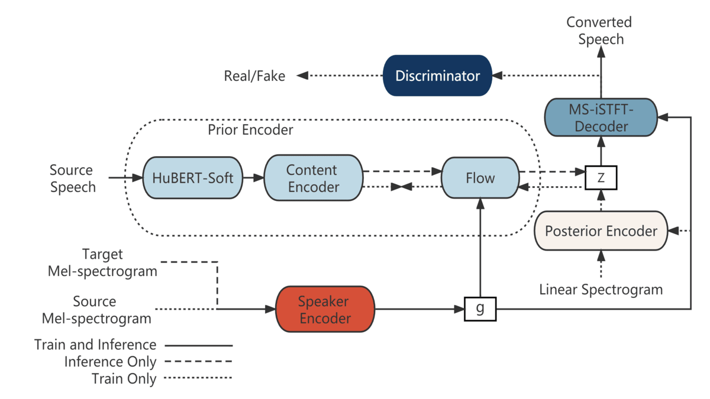

# QuickVC

[](https://arxiv.org/abs/2302.08296)

This repository contains the open source code, audio samples and pretrained models of paper: QuickVC: Any-to-many Voice Conversion Using Inverse Short-time Fourier Transform for Faster Conversion



## ⚙️ Installation

### 🔧 Set Up the Python Environment

1. **Clone the repository**

1. **Install `uv` — A fast Python package manager**\
   📖 [Installation guide](https://docs.astral.sh/uv/getting-started/installation/)

1. **Create and activate a virtual environment**

   ```bash
   uv venv .venv
   source .venv/bin/activate
   ```

1. **Install dependencies**

- For inference only:

  ```bash
  uv pip install .
  ```

- For development and full tool support (includes `Taskfile` and `pre-commit`):

  ```bash
  uv pip install -e .[dev]
  ```

## [Pretrained Model](https://drive.google.com/drive/folders/1DF6RgIHHkn2aoyyUMt4_hPitKSc2YR9d?usp=share_link)

Put pretrained model into `checkpoints/pretrained`

## Inference with pretrained model

```python
from quickvc.wrapper import QuickVC

# Initialize model
vc = QuickVC(
    config_path="configs/quickvc.yaml",
    checkpoint_path="checkpoints/quickvc.pth",
)

# Run conversion
converted_audio, sr = vc.convert_voice(
    source="audio/source.wav",
    target="audio/target.wav",
)

# Save output
import soundfile as sf

sf.write("converted.wav", converted_audio, sr)
```

### Or run using cli:

```bash
task infer
```

> See `Taskfile.yaml` for details

## Preprocess [WIP]

1. Hubert-Soft

   ```bash
   cd dataset
   python encode.py soft dataset/VCTK-16K dataset/VCTK-16K
   ```

1. Spectrogram resize data augumentation, please refer to [FreeVC](https://github.com/OlaWod/FreeVC).

## Train [WIP]

```bash
python train.py
```

If you want to change the config and model name, change in `utils.py`:

```python
parser.add_argument(
    "-c",
    "--config",
    type=str,
    default="./configs/quickvc.json",
    help="JSON file for configuration",
)
parser.add_argument("-m", "--model", type=str, default="quickvc", help="Model name")
```

In order to use the sr during training, change [this part](https://github.com/quickvc/QuickVC-VoiceConversion/blob/277118de9c81d1689e16be8a43408eda4223553d/data_utils_new_new.py#L70) to

```python
i = random.randint(68, 92)
c_filename = filename.replace(".wav", f"_{i}.npy")
```

## 📚 References

- ⚡️ [QuickVC-VoiceConversion](https://github.com/quickvc/QuickVC-VoiceConversion) - Original repository
